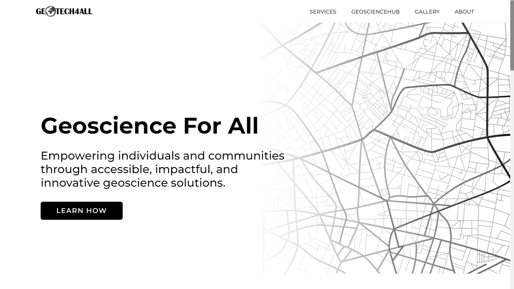

# GEOTECH4ALL

## Overview

A community that specializes in everything geoscience. News, articles, webinars, conferences, podcasts etc.

## Table of contents

- [The challenge](#the-challenge)
- [Links](#links)
- [Built with](#built-with)
- [Continued development](#continued-development)
- [Author](#author)

### The challenge

Users should be able to:

- View the optimal layout for each of the website's pages depending on their device's screen size.
- See hover states for all interactive elements on the page.
- Recieve email notifications for new articles when they signup to the newsletter.
- Signup for services they seek and get a follow up email.

Writers should be able to:

- Signup to the platform.
- Create and pulish well formatted articles.
- Publish headlines, trending stories or news within the geoscience space.

### Links

- [Demo](https://geotech4all.vercel.app)

### Built with

- [Next.js](https://nextjs.org/docs)
- [Typescript](https://typescriptlang.org)
- [TailwindCSS](https://tailwindcss.com/docs)

### Continued development

- Complete the UI and populate it with actual content.
- Write logic to cycle through headlines.
- I will also be working on the generalserver functionalities.

## Author

- Twitter - [Taqib](https://twitter.com/_Mihaq)
- Linkedin - [Taqib](https://www.linkedin.com/in/taqib-ibrahim)
